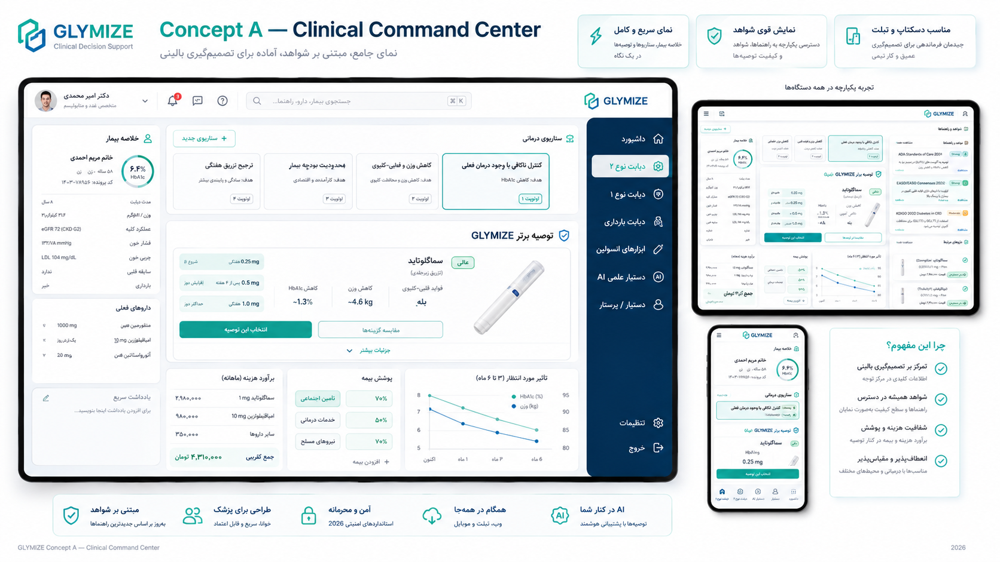
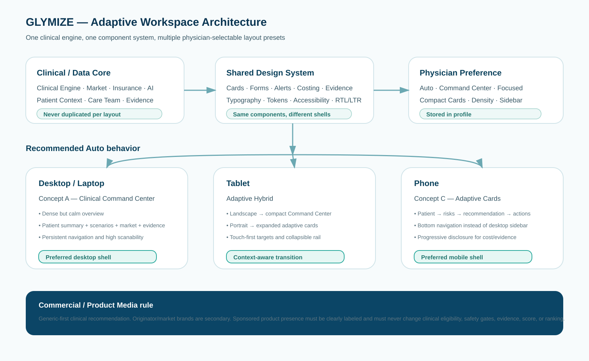

# GLYMIZE UX / Layout Vision — Future Design Review

**Status:** Design direction / future review
**Implementation timing:** After the clinical engine, Market/Costing, patient inputs, AI, Assistant, Auth/Communications, Care Team and core workflows are functionally stable.
**Current decision:** Do not perform a full redesign now. Only fix usability blockers such as unreadably small secondary text and overly dark hover/active button states.

---

## 1. Selected direction

For the future GLYMIZE Design System v2:

- **Desktop / Laptop:** Concept A — **Clinical Command Center**
- **Phone:** Concept C — **Mobile-First Adaptive Cards**
- **Tablet:** adaptive hybrid:
  - Landscape → compact Command Center
  - Portrait → expanded Adaptive Cards
- **Concept B:** retained as an optional **Focused Workflow** mode.

The preferred default is **Auto**, which adapts the shell to the device while keeping the same clinical components and data.





---

## 2. Important architectural rule

GLYMIZE must **not** become three separate applications.

All layouts use:

```text
Clinical / Data Core
        ↓
Shared Design System & Components
        ↓
Layout Shell / Preset
 ├─ Command Center
 ├─ Focused Workflow
 └─ Adaptive Cards
```

Clinical logic, patient state, Market data, AI output, insurance, evidence and recommendation ranking must never be duplicated per layout.

This prevents:
- three implementations of the same feature;
- inconsistent clinical outputs between devices;
- unnecessary runtime/data loading;
- excessive maintenance cost.

---

## 3. Physician-selectable workspace

A physician may choose a preferred layout in Profile:

```text
Workspace
○ Auto — Recommended
○ Command Center
○ Focused Workflow
○ Compact / Adaptive Cards
```

Possible preference model:

```ts
interface PhysicianUiPreferences {
  layoutPreset:
    | "auto"
    | "command_center"
    | "focused_workflow"
    | "compact_cards";

  density:
    | "comfortable"
    | "compact";

  sidebarMode:
    | "expanded"
    | "compact";
}
```

### Auto behavior

```text
Desktop           → Concept A / Command Center
Tablet landscape  → Concept A Compact
Tablet portrait   → Concept C Expanded
Phone             → Concept C
```

The user may override Auto if desired.

---

## 4. Concept A — Clinical Command Center

### Purpose

Best suited to desktop/laptop use where a physician can scan several related clinical domains at once.

### Desired structure

```text
┌ Patient context ┐ ┌ Main clinical decision workspace ┐ ┌ Navigation ┐
│ summary         │ │ scenarios / recommendation       │ │ modules    │
│ risks           │ │ cost & insurance                 │ │ AI         │
│ current meds    │ │ evidence / rationale             │ │ care team  │
└─────────────────┘ └───────────────────────────────────┘ └────────────┘
```

### Strengths

- High information density without needing many page changes.
- Good fit for GLYMIZE because the application combines:
  - clinical recommendations;
  - patient context;
  - market/pricing;
  - insurance;
  - evidence;
  - AI;
  - care-team handoff.
- Excellent for larger screens and repeated professional use.

### Risks to avoid

- Do not make every panel equally prominent.
- Avoid excessive card borders and decorative visual noise.
- Never use very small secondary text simply to fit more information.
- Use progressive disclosure for deep insurance/evidence/product details.

---

## 5. Concept C — Mobile-First Adaptive Cards

The mobile application must not be a scaled-down desktop.

Preferred mobile information hierarchy:

```text
Patient
  ↓
Critical clinical context / safety flags
  ↓
Top recommended scenario
  ↓
Primary actions
  ↓
Cost / insurance
  ↓
Alternative scenarios
  ↓
Evidence / details
```

### Navigation

Desktop sidebar should become bottom navigation or a compact mobile menu.

### Mobile priorities

- one-handed use;
- large touch targets;
- clear primary action;
- readable body copy;
- short cards;
- progressive disclosure;
- preserve clinical hierarchy;
- no horizontal data tables unless absolutely necessary.

---

## 6. Concept B — Focused Workflow

Concept B remains valuable even though it is not the preferred default.

Use it as an optional focus mode for physicians who prefer a step-by-step visit workflow:

```text
Patient definition
→ Clinical assessment
→ Treatment priorities
→ Scenarios
→ Cost / access
→ Evidence / handoff
```

It should use the same components and data as Command Center, only arranged sequentially.

---

## 7. Typography / readability

Current GLYMIZE secondary clinical copy is too small in several places.

Future readability target:

```text
Primary body / clinical copy      13.5–14 px minimum
Rationale / trade-offs            13–13.5 px
Field labels                      13–13.5 px
Insurance chips                   11.5–12 px
Calculation notes / footnotes     12.5–13 px
Very secondary metadata           ≥ 12 px
```

Headings that are currently visually balanced do not need to become larger.

On mobile, secondary clinical copy should generally not drop below ~13 px.

---

## 8. Button hover / active states

Current hover/active behavior can become too dark and make the text difficult to read.

Future token behavior:

```text
normal  → neutral / accent-soft
hover   → slightly stronger accent, never near-black
active  → one level stronger than hover
focus   → visible focus ring
text    → always maintains accessible contrast
```

Requirements:
- no sudden dark fill on ordinary clinical buttons;
- hover should communicate interactivity without visual aggression;
- destructive actions remain visually distinct;
- use `:focus-visible` for keyboard accessibility;
- preserve WCAG contrast.

This is considered a small usability fix and may be implemented before the full Design System v2.

---

## 9. Product image / brand policy

### Current preferred behavior

No product packshot/image is required in the primary clinical recommendation UI.

Primary information should remain:

```text
Generic / combination identity
Clinical role
Safety / evidence
Market availability
Insurance
Price
```

### Brand identity must be separated into

```text
Generic identity
Originator / reference brand
Iran market brands
Sponsored presentation
```

The generic identity remains the primary clinical identity.

---

## 10. Originator brand

An originator/reference brand may be shown as secondary reference information.

Example:

```text
Insulin glargine / lixisenatide
Fixed-ratio combination

Originator reference:
Suliqua®
```

However, GLYMIZE must not imply that the originator is currently available in Iran unless Iran-market verification exists.

Suggested model:

```ts
type BrandRole =
  | "originator"
  | "iran_market"
  | "sponsored";

type IranMarketStatus =
  | "verified"
  | "not_verified"
  | "unavailable"
  | "unknown";
```

---

## 11. Sponsored product policy

Future sponsorship may allow a pharmaceutical company to purchase **product visibility**, but never clinical ranking.

Mandatory rule:

```text
Sponsorship MUST NOT affect:
- clinical eligibility
- safety gates
- contraindication logic
- clinical score
- scenario rank
- guideline evidence
- generic recommendation
```

Preferred hierarchy:

```text
Independent Clinical Recommendation
            ↓
Generic-first recommendation
            ↓
Market options
 ├─ verified Iran-market brands
 ├─ originator reference
 └─ sponsored product presentation
```

Sponsored content must be clearly labeled.

A sponsored image/packshot may be displayed in the sponsored market slot when legally and operationally appropriate.

The value proposition should be:

> Product visibility can be sponsored. The recommendation engine cannot be purchased.

---

## 12. Product media model — prepare now, render later

Suggested future-ready model:

```ts
interface ProductMedia {
  imageUrl?: string;
  imageSource?: string;
  imageVerifiedAt?: string;

  imageType?:
    | "official_packshot"
    | "device"
    | "originator_reference"
    | "sponsored_product";

  displayPermission:
    | "hidden"
    | "clinical_detail"
    | "market_detail"
    | "sponsored_slot";
}
```

Initial default:

```text
displayPermission = hidden
```

This lets GLYMIZE add verified product imagery later without redesigning the data model.

---

## 13. Responsive implementation principles

### Desktop
- persistent navigation;
- wider clinical workspace;
- side patient context;
- multi-column only where scanability improves;
- sticky context panels allowed.

### Tablet
- touch-first controls;
- collapsible context rail;
- fewer simultaneous columns;
- portrait and landscape can use different shell rules.

### Mobile
- one primary column;
- bottom navigation;
- progressive disclosure;
- sticky primary action only if it does not obscure content;
- no permanent desktop side rail.

---

## 14. Performance rule

Layout presets must not trigger independent copies of the Market dataset or rebuild expensive indexes.

One runtime state:

```text
Market / Clinical state
        ↓
Shared memoized selectors
        ↓
Shared components
        ↓
Selected layout shell
```

Switching layouts should primarily change component placement and responsive styling, not data processing.

---

## 15. Accessibility

Future Design System v2 must include:

- WCAG-aware text/background contrast;
- visible keyboard focus;
- minimum touch target sizes;
- semantic labels;
- reduced-motion compatibility;
- RTL and LTR parity;
- readable Persian and English typography;
- no meaning encoded by color alone.

---

## 16. Design tokens to define before redesign

Before implementing the three presets, define shared tokens for:

```text
Typography scale
Spacing scale
Radii
Borders
Surface hierarchy
Accent colors
Success / warning / danger
Text / muted text
Hover / active / focus states
Card elevation
Responsive breakpoints
Touch targets
Motion
```

Do not create per-page arbitrary values.

---

## 17. Implementation order

The large redesign should begin only after these areas are considered stable enough:

1. Clinical Engine / Type 2 decision flow
2. Medication Market and package-aware costing
3. Insulin tools
4. Patient inputs / handoff
5. Care Team
6. AI runtime and model configuration
7. Evidence Assistant
8. Auth / physician identity / Communications
9. Admin publishing/data update workflow
10. PWA / online runtime stability

Then:

```text
Design audit
→ Design tokens
→ Shared component cleanup
→ Command Center shell
→ Adaptive mobile shell
→ Focused Workflow shell
→ Profile layout preferences
→ tablet adaptation
→ accessibility audit
→ usability testing
```

---

## 18. Immediate changes allowed before full redesign

Only small non-disruptive usability fixes:

- increase small clinical/body copy;
- lighten overly dark button hover/active states;
- preserve readable contrast;
- fix obvious mobile overflow or touch-target issues;
- no broad visual restyling yet.

---

## 19. Decision snapshot

As of this design review:

```text
Preferred desktop: Concept A — Clinical Command Center
Preferred mobile: Concept C — Adaptive Cards
Tablet: hybrid adaptive behavior
Concept B: optional Focused Workflow
Physician-selectable layouts: YES
Default: Auto
Product images today: hidden
Originator brand: allowed as secondary reference
Sponsored product image later: allowed in clearly labeled market/sponsor slot
Sponsor influence on clinical ranking: NEVER
Full redesign timing: after core functional validation
```

---

## 20. Review note

This document is a future-design decision record, not an instruction to immediately rewrite the current UI.

When GLYMIZE reaches the Design System v2 phase, revisit this document together with:
- current production screenshots;
- mobile/tablet usability findings;
- physician feedback;
- accessibility audit;
- performance profiling;
- sponsor/product-media legal/commercial policy.

---

## 21. Physician profile photo from Medical Council / IRIMC — onboarding delight

A useful future onboarding behavior is to prefill the physician profile photo from the verified Medical Council / IRIMC identity record when a reliable public photo is available.

### UX objective

After successful physician identity matching:

```text
IRIMC exact identity match
        ↓
Public physician photo available?
   ├─ No  → initials/default medical avatar
   └─ Yes → show as suggested profile photo
                  ↓
        [Use this photo] [Change photo] [Remove]
```

The experience may feel pleasantly personalized, but it should remain transparent rather than mysterious.

Suggested onboarding copy:

```text
عکس پروفایل شما از رکورد نظام پزشکی پیدا شد.
می‌توانید همین عکس را نگه دارید یا آن را تغییر دهید.
```

English:

```text
We found a profile photo in your verified Medical Council record.
You can keep it, replace it, or remove it.
```

### Important separation: identity verification vs display photo

The Medical Council match remains the identity-verification source.

The profile photo is **display-only** and must never become an authentication or identity-match requirement.

```text
IRIMC verified physician identity
        ≠
current GLYMIZE display photo
```

A physician may replace or remove the profile image without losing the verified-physician state.

### Suggested data model

```ts
interface PhysicianProfilePhoto {
  source:
    | "irimc"
    | "physician_upload"
    | "generated_initials"
    | "none";

  imageUrl?: string;
  sourceUrl?: string;
  fetchedAt?: string;
  updatedAt?: string;

  // identity verification and profile imagery are intentionally separate
  identityVerifiedByIrimc: boolean;

  displayStatus:
    | "suggested"
    | "accepted"
    | "replaced"
    | "removed";
}
```

### Fetch / storage requirements

Implementation should be server-side where practical; do not make the browser responsible for scraping a third-party physician page.

Before production use, verify:
- the source actually exposes a physician photo reliably;
- the allowed technical method for retrieving it;
- terms / usage restrictions for copying or caching profile images;
- refresh / invalidation behavior;
- what happens when the source photo changes or disappears.

Do not silently hotlink an external image forever if GLYMIZE cannot guarantee availability and permission.

### Error and mismatch safety

If the image endpoint fails, the registration flow must continue.

If the identity match is exact but photo retrieval fails:

```text
Registration → continue
Photo        → fallback avatar
```

If there is any uncertainty that the photo belongs to the verified IRIMC identity, do not display it automatically.

### Physician controls

Profile should always offer:

```text
Change photo
Restore Medical Council photo
Remove photo
```

"Restore Medical Council photo" should re-fetch/revalidate the source rather than relying indefinitely on an old cached image.

### Privacy / trust UX

The source should be visible in subtle profile metadata:

```text
Profile photo source: Medical Council
```

This avoids a “how did the app get my photo?” reaction while preserving the onboarding delight.

### Future layout use

Command Center:
- small physician avatar in the top bar;
- avatar is not a dominant clinical element.

Mobile Adaptive Cards:
- compact avatar in account/profile surfaces;
- do not spend valuable clinical-card space on the physician image.

Focused Workflow:
- avatar belongs to shell/account chrome, not the clinical step content.
